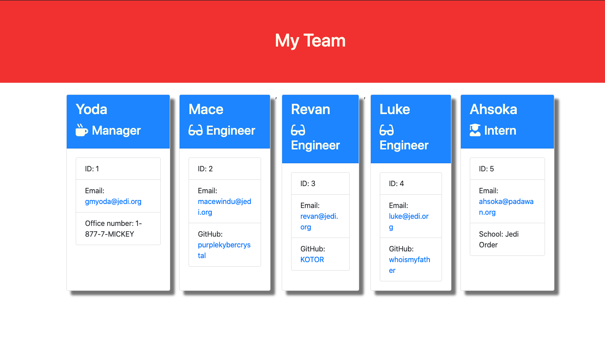

# Team Profile Generator
  
  ## Table of Contests
  -[Description](#description)
  -[Instalation](#install)
  -[Usage](#usage)
  -[Licences](#licences)
  -[Contribution](#contribution)
  -[Test](#tests)
  -[Question](#questions)
  
  
  ## Description
  As a manager
  I want to generate a webpage that displays my team's basic info
  so that I have quick access to emails and GitHub profiles
  
  ## Install

  npm install
  
  ## Usage
  
  The project must generate a `team.html` page in the `output` directory, that displays a nicely formatted team roster. Each team member should display the following in no particular order:

  * Name

  * Role

  * ID

  * Role-specific property (School, link to GitHub profile, or office number)
  
  ## Licence

  None
  
  ## Contribution
  
   * Use validation to ensure that the information provided is in the proper expected format.

    * Add the application to your portfolio.
  
  ## Test
  
  npm run test 
  
  ## Questions

  ### [cfergus7 GitHub](https://github.com/)  
  
  ### Email cfergus7@gmail.com

  ## Screen Shots
  
